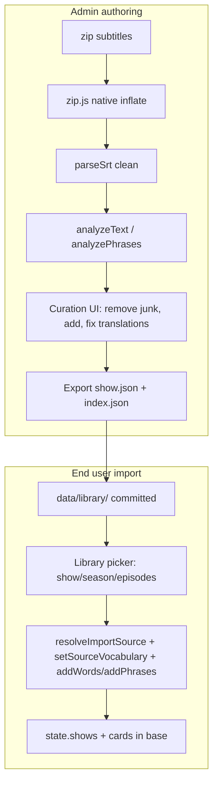

# План фичи: Библиотека сериалов + админ-авторинг

> Зафиксировано 2026-06-23. Реализация — в следующей сессии. Это рабочий план; после реализации перенести итог в `agent-changelog.md`.

## Что делаем
Две связанные возможности на статическом офлайн-приложении (бэкенда нет):

1. **Пользователь:** на странице «Импорт» — выбрать готовый сериал из библиотеки (весь сериал / сезон / отдельные серии) → авто-импорт в базу через существующий конвейер.
2. **Админ** (переключатель в Настройках + пароль `54321`): инструмент авторинга — загрузить zip(ы) с субтитрами, очистить от мусора, отредактировать слова/переводы, экспортировать набор в `data/library/<show>.json` (+ обновлённый `index.json`) для коммита.

## Зафиксированные решения (развилки)
- **Хранение/доставка библиотеки:** авторский режим → экспорт JSON в `data/library/`, коммит в репозиторий (видно всем).
- **zip:** распаковка в браузере, нативно через `DecompressionStream("deflate-raw")`, без сторонних либ.
- **Курирование переводов:** правки запекаются только в файл библиотеки `data/library/<show>.json` (без пересборки общего словаря).
- **Гейт админки:** тумблер в Настройках + пароль `54321` (флаг в `localStorage`). Это лишь скрытие раздела, не криптозащита.

## Поток данных

## Формат данных (`data/library/`)
- `index.json`: `{ "shows": [ { "id", "title", "file", "seasons": N, "episodes": M } ] }`
- `<id>.json` (самодостаточный, курированный):
  - `seasons[].episodes[]`: `{ number, title, words: ["lemma"...], phrases: ["go on"...] }` — очищенные снимки лексики на серию.
  - `translations`: `{ words: { lemma: ["перевод"...] }, phrases: { text: [...] } }` — запечённые переводы (приоритет над общим словарём; мусор просто отсутствует в списках).

## Новые файлы
- `js/import/zip.js` — нативный ZIP-ридер: разбор EOCD/central directory, инфляция записей через `DecompressionStream("deflate-raw")` (метод 8) или копия (метод 0). Тот же приём для gzip уже в `js/import/dictionary.js`.
- `js/import/library.js` — ленивая загрузка `index.json` и `<id>.json` (кэш, как в dictionary.js); хелпер `importLibraryEpisodes(state, episodes, dict, forms, phrasesDb)` (создаёт источник, ставит снимок, добавляет карточки с переводами библиотеки/словаря, пропуская known/stop — по образцу `ensureSnapshotItems` из `js/core/readiness.js`).
- `js/views/admin-library.js` — инструмент авторинга (загрузка zip, разбор, курирование, экспорт). Черновик в `localStorage` (`se-admin-drafts`); полный текст после анализа не держим.
- `data/library/index.json` — стартовый каркас (`shows: []`); наполняется экспортом из админки (для теста — из двух zip).

## Изменяемые файлы
- `js/views/import.js`: кнопка «Выбрать из библиотеки» → панель-пикер (сериалы → сезоны → серии с чекбоксами; «весь сериал/сезон»; нижний бар «Импортировать выбранные (N)»). Импорт через `importLibraryEpisodes` + сводка с кнопками «Дополнить переводы»/«К тренировке».
- `js/views/settings.js`: секция «Админ-режим» — тумблер; при включении `prompt()` пароль, сверка с `54321`, флаг `localStorage.se-admin`. Кнопка «Открыть админ-библиотеку» → `ctx.navigateTo("library-admin")` (видна только в админ-режиме).
- `js/router.js`: роут `library-admin` → `renderAdminLibrary`. Мобильное меню (6 кнопок) не трогаем — вход только из Настроек.
- `css/styles.css`: стили пикера (`.lib-shows/.lib-show/.lib-season/.lib-episodes/.lib-actionbar`) и админ-инструмента; переиспуем `.card/.btn/.tag/.trans-chips`.
- `js/version.js` + каскад `?v=` + документация.

## Админ-курирование (в `admin-library.js`)
- Загрузка zip → `unzip` → для каждой `.srt`: `parseSrt` (чистка) + `parseFileName` (S01E07 → сезон/серия/название; редактируется вручную).
- `analyzeText/analyzePhrases` (с `getDictionary/getFormsIndex/getPhrases`) → списки лемм/фраз + переводы-подсказки.
- UI курирования: список слов/фраз с чипами переводов (`js/ui/trans-chips.js`), кнопки удалить/добавить, правка переводов; «мусор» исключается из набора.
- Экспорт: скачивание `<id>.json` и обновлённого `index.json` (подтянуть текущий index, смерджить запись). Файлы кладутся в `data/library/` и коммитятся.

## Версии ассетов и документация
- Меняются `import.js`, `settings.js`, `router.js`, добавляются модули → bump единой версии до `20260640` по цепочке кэша: `index.html` (css уже `20260640` + script `app.js`) → `app.js` (import `router.js`) → `router.js` (imports `import.js`, `settings.js`, новый `admin-library.js`) → импорты новых модулей. Цепочку `?v=20260621` (trans-chips и др.) и bare-импорты не трогаем (gotcha — дубли модулей).
- Обновить `js/version.js`, `docs/agent-changelog.md`, `docs/agent-spec.md` (формат библиотеки), `agent-plan.md`.

## Ограничения и риски
- `DecompressionStream("deflate-raw")` есть в актуальных Chromium/Firefox; для старых браузеров — fallback (вендоринг `fflate` одним ESM-файлом). Проверить на реальных zip при тесте.
- «Админ-пароль» — лишь скрытие раздела.
- Реальные субтитры топ-сериалов в репозиторий не кладём автоматически — их готовит админ из zip (для теста — два сезона).

## Порядок (фазы)
1. Админ-гейт (Настройки + пароль) и роут.
2. ZIP-ридер + админ-инструмент (zip → чистка → анализ → курирование → экспорт). Тест на двух zip.
3. Формат библиотеки + загрузчик.
4. Пользовательский пикер на «Импорте» + авто-импорт.
5. CSS, bump версий, документация.

## To-do (для следующей сессии)
- [x] **admin_gate** — Settings: тумблер + пароль 54321 (флаг localStorage); роут `library-admin`; кнопка перехода.
- [x] **zip_reader** — `js/import/zip.js`: нативная распаковка zip + копия для несжатых.
- [x] **admin_tool** — `js/views/admin-library.js`: zip → parseSrt → analyze → курирование → черновик в localStorage.
- [x] **export** — экспорт `<id>.json` + мердж `index.json`.
- [x] **lib_format** — `data/library/` + `js/import/library.js` + `importLibraryEpisodes`.
- [x] **user_picker** — `import.js`: кнопка + пикер + авто-импорт + сводка.
- [x] **css** — стили админ-инструмента и пикера библиотеки.
- [x] **version_docs** — agent-spec §5.1, changelog, push `?v=20260655`.
